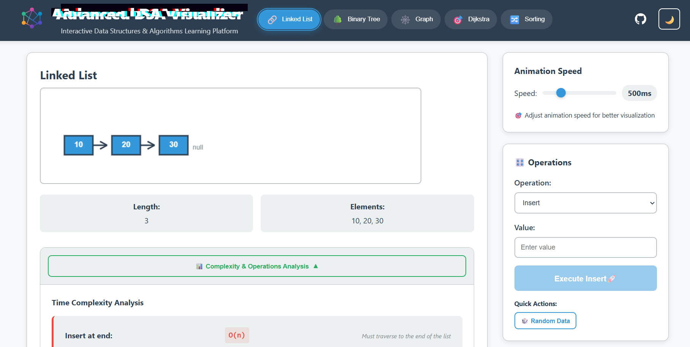
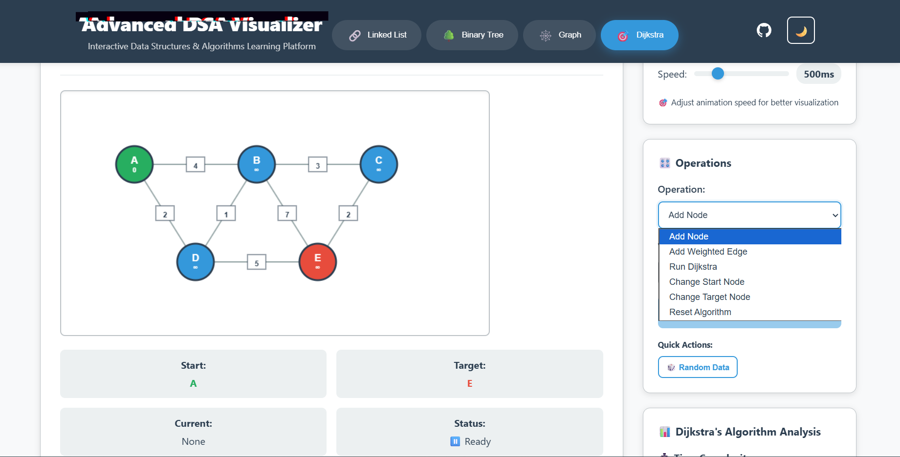
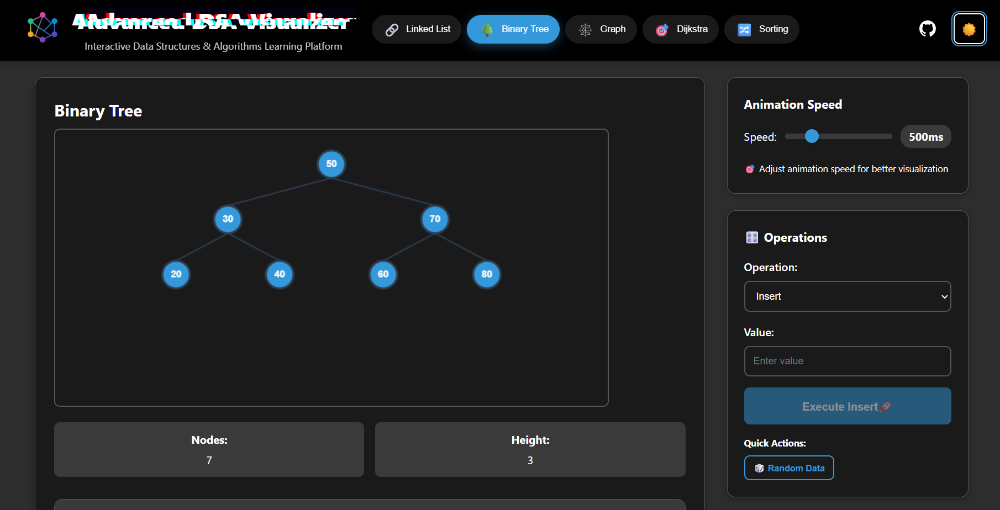

# DSA Visualizer

Interactive web application for visualizing data structures and algorithms with real-time animations.

## Features

- **Linked Lists** - Insert, delete, search operations with visual pointers
- **Binary Search Trees** - Tree construction and traversals (Inorder, Preorder, Postorder)
- **Graph Algorithms** - DFS and BFS traversal visualization
- **Dijkstra's Algorithm** - Shortest path finding with weighted edges
- **Dark/Light Theme** - Toggle between themes for comfortable viewing
- **Speed Controls** - Adjustable animation speeds for better learning
- **Responsive Design** - Works on desktop, tablet, and mobile devices

## Tech Stack

| Technology | Purpose | Version |
|------------|---------|---------|
| **React** | Frontend Framework | 18.0+ |
| **JavaScript (ES6+)** | Programming Language | Latest |
| **HTML5 Canvas** | Graphics Rendering | Native |
| **CSS3 Variables** | Theming & Styling | Latest |
| **Create React App** | Build Tool | Latest |

## Project Structure

```DSA-VISUALIZER/
├── 📂 public/
│ ├── 📄 index.html
│ ├── 📋 manifest.json
│
├── 📂 src/
│ ├── 📂 algorithms/
│ │ ├── 🌳 binaryTree.js # Binary tree logic
│ │ ├── 🎯 dijkstra.js # Dijkstra's algorithm
│ │ ├── 🕸️ graph.js # Graph operations
│ │ └── 🔗 linkedList.js # Linked list operations
│ │
│ ├── 📂 components/
│ │ ├── 📊 AnalysisPanel.js # Complexity analysis display
│ │ ├── 🎮 AnimationControls.js # Speed and playback controls
│ │ ├── 🎛️ ControlPanel.js # Operation control interface
│ │ ├── 🎯 DijkstraVisualizer.js # Dijkstra visualization
│ │ ├── 🐙 GithubButtons.js # GitHub integration
│ │ ├── 🕸️ GraphVisualizer.js # Graph visualization
│ │ ├── 🔗 LinkedListVisualizer.js # Linked list visualization
│ │ └── 🌳 TreeVisualizer.js # Binary tree visualization
│ │
│ ├── 📂 styles/
│ │ ├── 🎨 App.css # Main application styles
│ │
│ ├── 📂 utils/
│ │ ├── 🎬 animation.js # Animation utilities
│ │ └── 🖼️ canvas.js # Canvas helper functions
│ │
│ ├── 📱 App.js # Main application component
│ ├── 🧪 App.test.js # Application tests
│ └── 🎨 index.css # Global styles
│
├── 📋 package.json # Project dependencies
```


## Getting Started

### Prerequisites

- **Node.js** (v14.0 or higher) - [Download here](https://nodejs.org/)
- **npm** (v6.0 or higher) - Comes with Node.js
- **Git** - [Download here](https://git-scm.com/)

### Installation

1. **Clone the repository**
```
git clone https://github.com/your-username/dsa-visualizer.git
cd dsa-visualizer
```

2. **Install dependencies**
```
npm install
```

3. **Start the development server**
```
npm start
```

4. **Open your browser**

Navigate to  to view the application.


## Usage

### Linked Lists
- Add nodes using the Insert operation
- Remove specific values with Delete
- Search for elements with visual highlighting
- Clear the entire list

### Binary Trees
- Insert values to build the tree structure
- Run different traversal algorithms
- Search for specific nodes
- Delete nodes with automatic restructuring

### Graphs
- Add nodes and connect them with edges
- Run DFS or BFS traversal algorithms
- Watch the step-by-step exploration process
- Reset and build custom graphs

### Dijkstra's Algorithm
- Create weighted graphs with custom edge costs
- Set start and target nodes
- Watch the shortest path calculation
- View the final optimal route

## Screenshots







## Future Implementations

### Sorting Algorithms
- [ ] Bubble Sort
- [ ] Quick Sort  
- [ ] Merge Sort
- [ ] Heap Sort
- [ ] Insertion Sort
- [ ] Selection Sort

### Advanced Data Structures
- [ ] AVL Trees
- [ ] Red-Black Trees
- [ ] Hash Tables
- [ ] Tries
- [ ] Priority Queues

### Graph Algorithms
- [ ] A* Search
- [ ] Bellman-Ford Algorithm
- [ ] Floyd-Warshall Algorithm
- [ ] Kruskal's Algorithm
- [ ] Prim's Algorithm
- [ ] Topological Sort

### Dynamic Programming
- [ ] Fibonacci Sequence
- [ ] Knapsack Problem
- [ ] Longest Common Subsequence
- [ ] Edit Distance

## Contributing

Contributions are welcome! Please feel free to submit a Pull Request.

### How to Contribute

1. Fork the repository
2. Create your feature branch (`git checkout -b feature/AmazingFeature`)
3. Commit your changes (`git commit -m 'Add some AmazingFeature'`)
4. Push to the branch (`git push origin feature/AmazingFeature`)
5. Open a Pull Request

### Development Guidelines

- Follow existing code style and conventions
- Add comments for complex logic
- Test your changes thoroughly
- Ensure responsive design principles
- Update documentation as needed

## License

This project is licensed under the MIT License - see the [LICENSE](LICENSE) file for details.

## Author

**Atharva**

## Acknowledgments

- Inspired by VisuAlgo and similar algorithm visualization tools
- Built with React and HTML5 Canvas

---

⭐ Star this repository if it helped you learn algorithms better!


