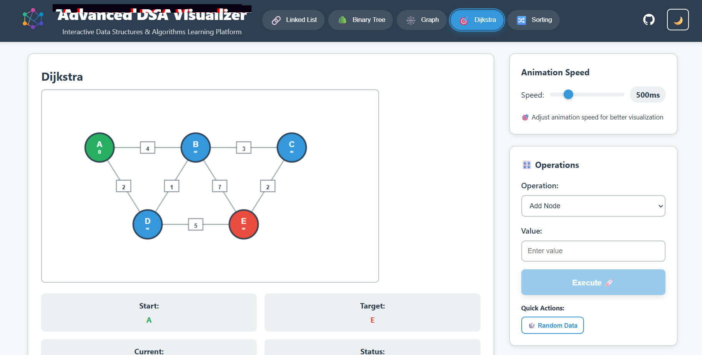

# DSA Visualizer

Interactive web application for visualizing data structures and algorithms with real-time animations and comprehensive C++ code examples.

## Features

- **Linked Lists** - Insert, delete, search operations with visual pointers and collapsible C++ code implementations
- **Binary Search Trees** - Tree construction and traversals (Inorder, Preorder, Postorder) with detailed algorithm explanations
- **Graph Algorithms** - Interactive DFS and BFS traversal visualization with step-by-step execution
- **Dijkstra's Algorithm** - Shortest path finding with weighted edges and priority queue optimization
- **Sorting Algorithms** - Complete implementations with dropdown selection:
  - **Merge Sort** - Divide-and-conquer visualization with merge operations
  - **Quick Sort** - Partitioning algorithm with pivot selection strategies
  - **Insertion Sort** - Building sorted array one element at a time
- **Collapsible Code Sections** - Expandable C++ implementations for every algorithm
- **Complexity Analysis** - Detailed time and space complexity breakdowns
- **Operations Analysis** - Interactive cards explaining algorithm operations
- **Dark/Light Theme** - Toggle between themes for comfortable viewing
- **Speed Controls** - Adjustable animation speeds for better learning
- **Responsive Design** - Works seamlessly on desktop, tablet, and mobile devices

## Tech Stack

| Technology | Purpose | Version |
|------------|---------|---------|
| **React** | Frontend Framework | 18.0+ |
| **JavaScript (ES6+)** | Programming Language | Latest |
| **HTML5 Canvas** | Graphics Rendering | Native |
| **CSS3 Variables** | Theming & Styling | Latest |
| **Create React App** | Build Tool | Latest |

## Project Structure

```
DSA-VISUALIZER/
├── public/
│ ├── index.html
│ ├── manifest.json
│ └── images/
│
├── src/
│ ├── algorithms/
│ │ ├── binaryTree.js # Binary tree logic
│ │ ├── dijkstra.js # Dijkstra's algorithm
│ │ ├── graph.js # Graph operations
│ │ ├── linkedList.js # Linked list operations
│ │ ├── mergeSort.js # Merge sort implementation
│ │ ├── quickSort.js # Quick sort implementation
│ │ └── insertionSort.js # Insertion sort implementation
│ │
│ ├── components/
│ │ ├── AnalysisPanel.js
│ │ ├── AnimationControls.js
│ │ ├── ControlPanel.js
│ │ ├── DijkstraVisualizer.js
│ │ ├── GithubButtons.js
│ │ ├── GraphVisualizer.js
│ │ ├── LinkedListVisualizer.js
│ │ ├── MergeSortVisualizer.js
│ │ ├── QuickSortVisualizer.js
│ │ ├── InsertionSortVisualizer.js
│ │ ├── SortingVisualizer.js
│ │ └── TreeVisualizer.js
│ │
│ ├── styles/
│ │ ├── App.css # Main application styles
│ │ └── GlitchText.css # Special text effects
│ │
│ ├── utils/
│ │ ├── animation.js # Animation utilities
│ │ └── canvas.js # Canvas helper functions
│ │
│ ├── App.js # Main application component
│ └── index.css # Global styles
│
└── package.json # Project dependencies
```


## Getting Started

### Prerequisites

- **Node.js** (v14.0 or higher) - [Download here](https://nodejs.org/)
- **npm** (v6.0 or higher) - Comes with Node.js
- **Git** - [Download here](https://git-scm.com/)

### Installation

1. **Clone the repository**
```
git clone https://github.com/your-username/dsa-visualizer.git
cd dsa-visualizer
```

2. **Install dependencies**
```
npm install
```

3. **Start the development server**
```
npm start
```

4. **Open your browser**

Navigate to [http://localhost:3000](http://localhost:3000) to view the application.


## Usage

### Linked Lists
- Add nodes using the Insert operation with real-time visual feedback
- Remove specific values with animated deletion process
- Search for elements with step-by-step traversal highlighting
- Access comprehensive C++ implementations in collapsible sections
- View complexity analysis and operation breakdowns

### Binary Trees
- Insert values to build the tree structure with automatic balancing visualization
- Run different traversal algorithms (Inorder, Preorder, Postorder) with highlighting
- Search for specific nodes with path visualization
- Delete nodes with automatic restructuring animation
- Explore detailed C++ code examples for each operation

### Graphs
- Add nodes and connect them with edges dynamically
- Run DFS or BFS traversal algorithms with real-time edge highlighting
- Watch the step-by-step exploration process with visited node tracking
- Reset and build custom graphs with random generation options
- Study comprehensive graph theory implementations

### Dijkstra's Algorithm
- Create weighted graphs with custom edge costs
- Set start and target nodes with visual indicators
- Watch the shortest path calculation with priority queue visualization
- View the final optimal route with distance calculations
- Access advanced implementations including optimizations

### Sorting Algorithms
- **Merge Sort**: Visualize divide-and-conquer approach with merge operations
- **Quick Sort**: Watch partitioning process with different pivot strategies
- **Insertion Sort**: See step-by-step building of sorted array
- Control animation speed and access detailed C++ implementations
- Compare algorithm performance with statistics tracking

## Screenshots


*Linked list operations with step-by-step animation*


*Shortest path visualization with weighted edges*


*Dark theme for comfortable late-night studying*


*sorting Algorithms with code implementations*

## Future Implementations

### Sorting Algorithms
- [ ] Bubble Sort
- [ ] Heap Sort
- [ ] Selection Sort
- [ ] Radix Sort

### Advanced Data Structures
- [ ] AVL Trees
- [ ] Red-Black Trees
- [ ] Hash Tables
- [ ] Tries
- [ ] Priority Queues
- [ ] Segment Trees

### Graph Algorithms
- [ ] A* Search
- [ ] Bellman-Ford Algorithm
- [ ] Floyd-Warshall Algorithm
- [ ] Kruskal's Algorithm
- [ ] Prim's Algorithm
- [ ] Topological Sort

### Dynamic Programming
- [ ] Fibonacci Sequence
- [ ] Knapsack Problem
- [ ] Longest Common Subsequence
- [ ] Edit Distance
- [ ] Matrix Chain Multiplication

## Contributing

Contributions are welcome! Please feel free to submit a Pull Request.

### How to Contribute

1. Fork the repository
2. Create your feature branch (`git checkout -b feature/AmazingFeature`)
3. Commit your changes (`git commit -m 'Add some AmazingFeature'`)
4. Push to the branch (`git push origin feature/AmazingFeature`)
5. Open a Pull Request

### Development Guidelines

- Follow existing code style and conventions
- Add comments for complex logic
- Test your changes thoroughly
- Ensure responsive design principles
- Update documentation as needed
- Include C++ code examples for new algorithms

## License

This project is licensed under the MIT License - see the [LICENSE](LICENSE) file for details.

## Author

**Atharva**

- 💼 [LinkedIn](https://www.linkedin.com/in/atharval2004)
- 📧 [Email](mailto:atharvalandge2004@gmail.com)

## Acknowledgments

- Inspired by VisuAlgo and similar algorithm visualization tools
- Thanks to the open-source community for resources and inspiration

---

⭐ Star this repository if it helped you learn algorithms better!


